# _NeighborSpace_

#### _A website for a pseudo-client; a community-based workspace company, 2/22/19_

#### By _**Aurora Shido-Wagenet**_

## Description

_This application provides the "client" with a website for their company, to find new clients and help exiting ones with anything they need._

## User Personas

#### Hermione

_A current neighbor_

###### Needs
* _info about workspace closure_
* _to tell owners about problems_
* _to feel like part of a community_

###### Pain Points
* _lack of ways to contact owners_
* _hard time connecting with other neighbors_

###### How to Serve
* _contact page_
* _office hours_

#### Harry

_A potential neighbor_

###### Needs
* _info about included amenities_
* _prices of spaces_
* _office hours_

###### Pain Points
* _backlog of page info_
* _gimmicky sales pitches_
* _too many corporate feeling spaces_

###### How to Serve
* _small, easy to navigate website_
* _directly priced packages_

#### Harry

_Co-Owner of NeighborSpace_

###### Needs
* _to attract new neighbors to the space_

###### Pain Points
* _corporate companies having more money and spaces_
* _lack of brand recognizability_

###### How to Serve
* _a clean site that feels more personal_
* _a theme to attract different kinds of clients_

## User Stories

* _As a potential client, I want to see the office space and included services so I can know if it's somewhere I'd like to work._
* _As a potential client, I want to see answered to commonly asked questions about the company so I can have all the information I need._
* _As a potential client, I want to be able to get in contact with the company to have any other specific questions answered._
* _As a potential client, I want to see what options there are for memberships so I can pick the best option for me._
* _As a current client, I want to see the office hours so I can plan my work week appropriately._
* _As a current client, I want to be able to get in contact with the company so I can give feedback and suggestions about my NeighborSpace._
* _As the owner, I want to feel like the website gives a good vibe of the company and plenty of information so potential clients feel welcome._

## Brainstorm

#### Thought Process
  _I want to look at other websites for other companies like this, but also sites for smaller less corporate sites of different kinds for inspiration on themes and color schemes._

#### Researched Sites

Company Site | What I Liked | What I Didn't
------------- | ----- | ------
WeWork | Clean design, Smooth media queries, Lots of info throughout | Too much white, Boring design, Lots of click throughs
TechSpace | Visually interesting, Consistent color scheme | Specific info pages kind of bare, Poor visual hierarchy
Case Study | More intimate/niche feeling, Unique visual style | Limited info, Empty looking pages

#### Ideas
* _Amenities in a prominent position_
* _Limited color scheme, warm and graphic (tan, light pink, and sky blue maybe?)_
* _Unique Features given more visual space and weight_
* _Very obvious layout for clients not in the tech field/tech-illiterate_
* _Community features?_
* _Profile/login pages_

## Paper Sketches

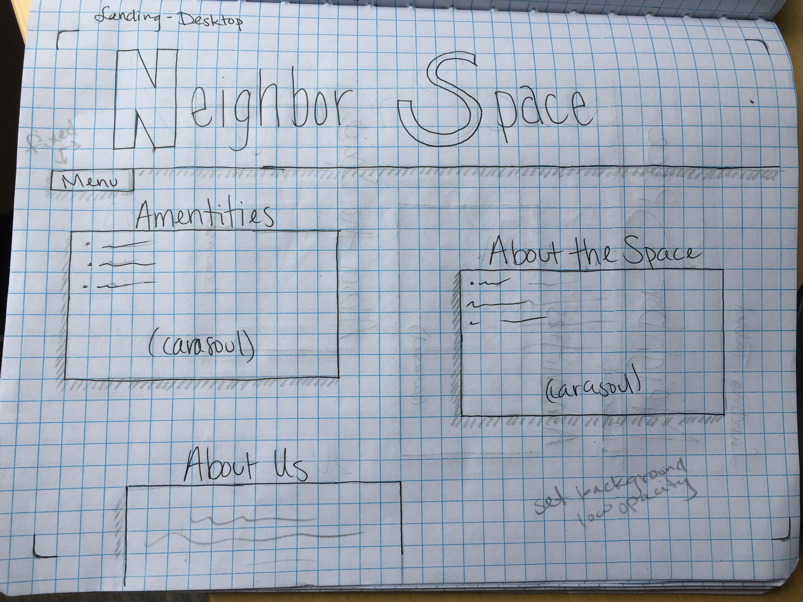
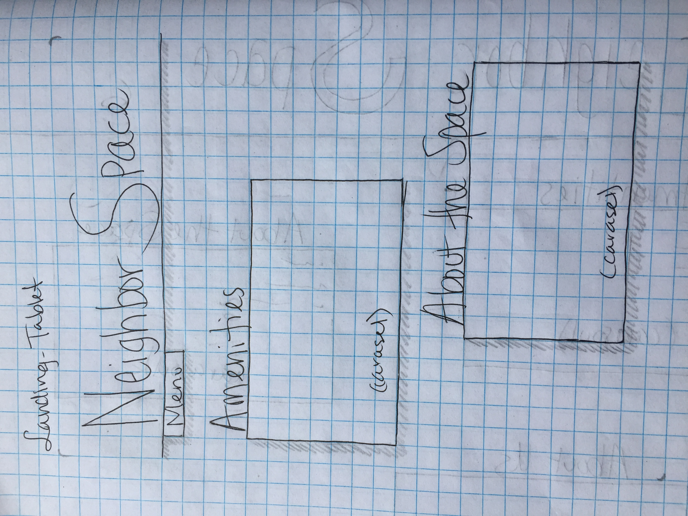
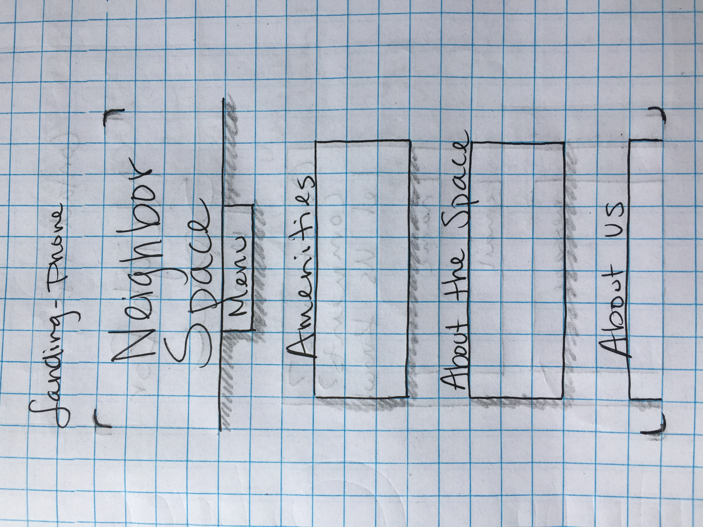
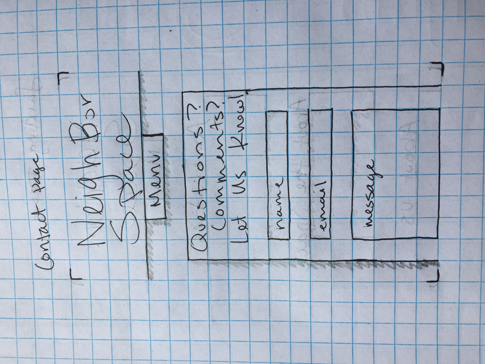
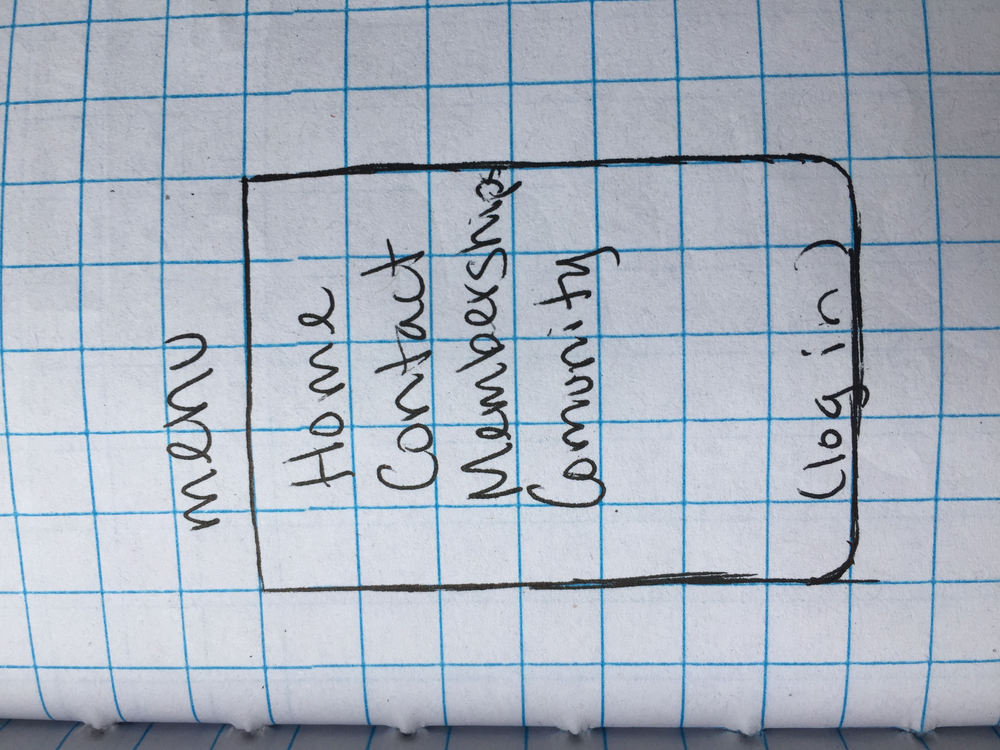
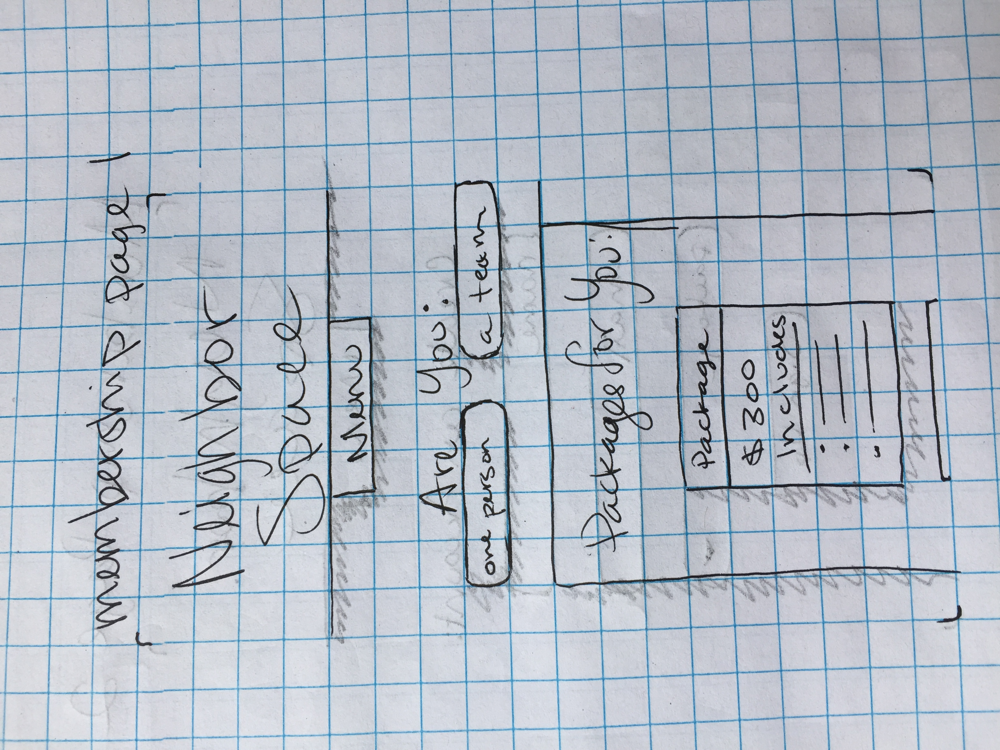
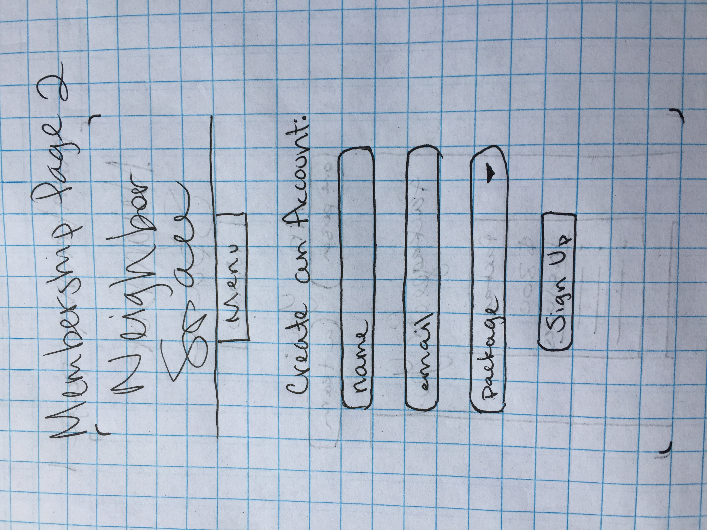
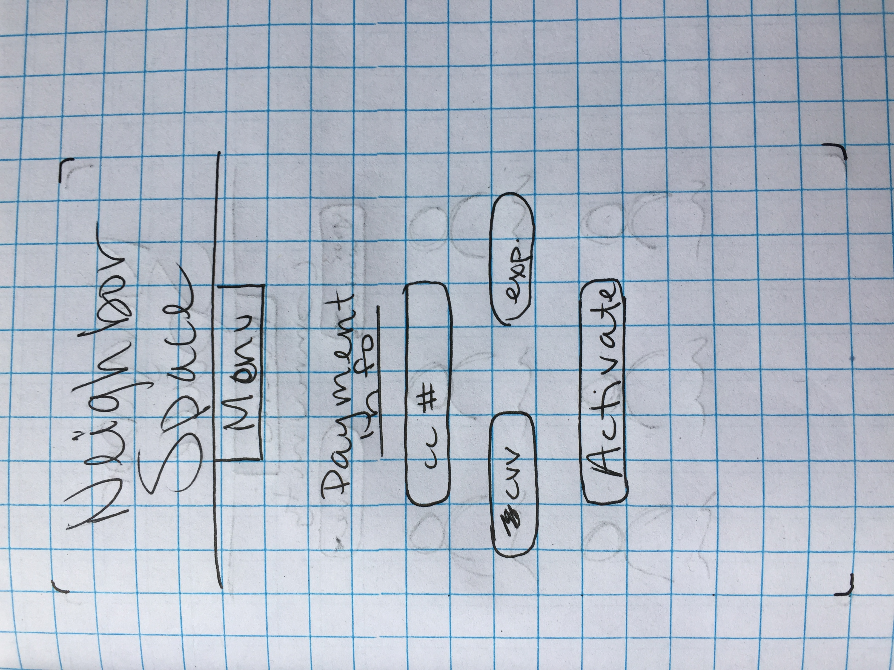
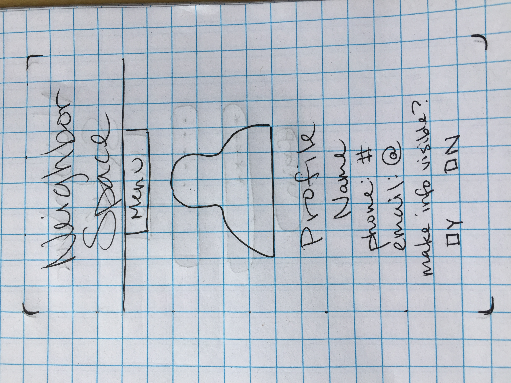
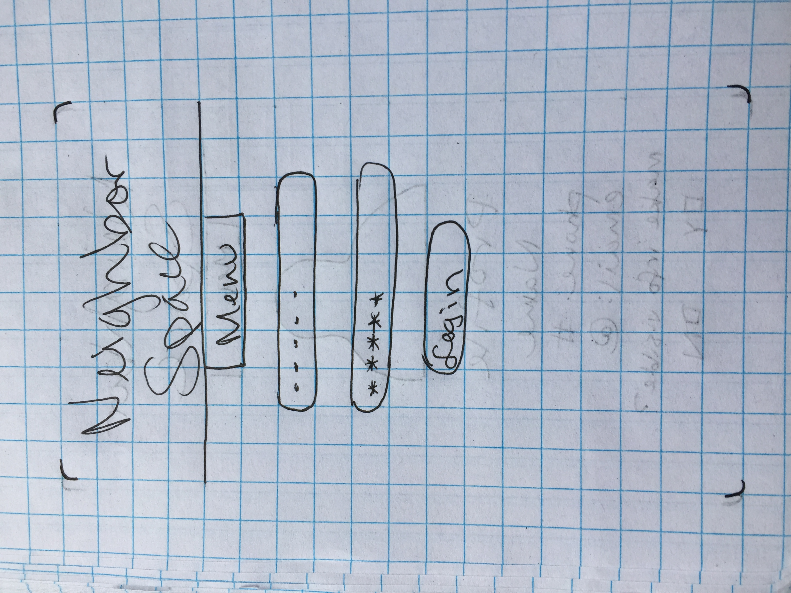
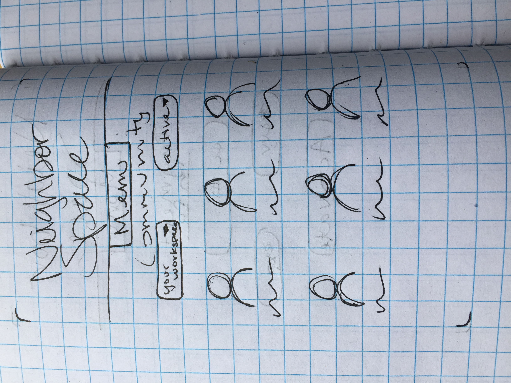

## Sketch Wireframes

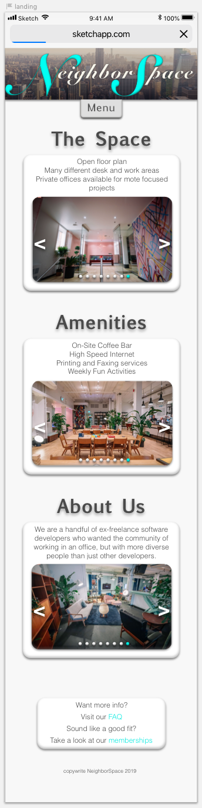
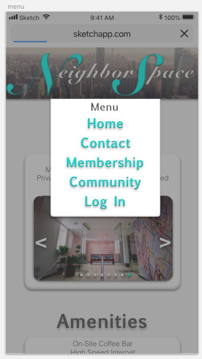
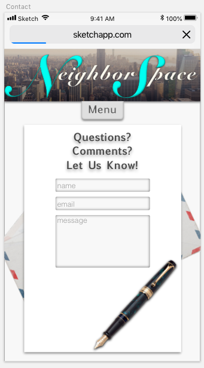
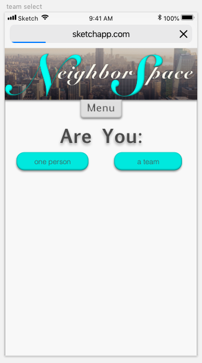
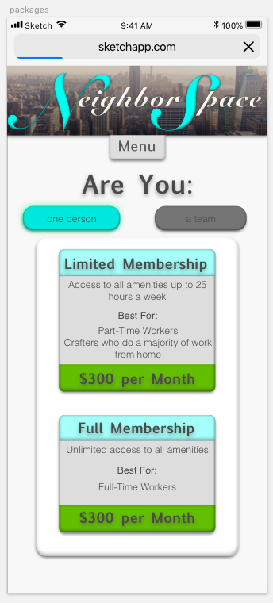
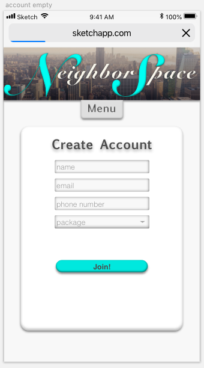
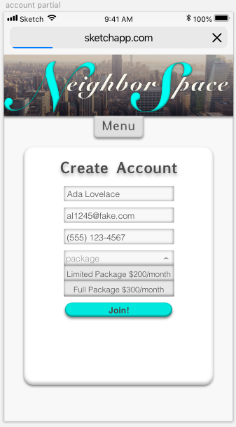
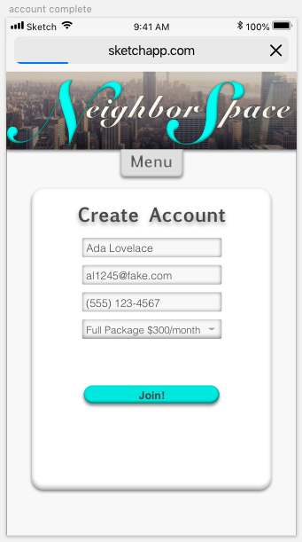

## Setup/Installation Requirements

* _Use your command terminal (gitbash if you're using a windows machine) to clone the latest commit from Github, using the url provided_
* _Open with a text editor such as Atom to view the code_
* _In your terminal run the command "npm install"_
* _Then, run the command "npm run start" to view_

## Known Bugs

_images do not show up sometimes_

## Support and contact details
_If you encounter any bugs or issues not documented during your experience, please feel free to contact me at my email: fullmetalwoman@gmail.com_

## Technologies used

_This application was created using HTML and CSS_

### License

Copyright (c) 2019 **_ Aurora Shido-Wagenet_**

Permission is hereby granted, free of charge, to any person obtaining a copy
of this software and associated documentation files (the "Software"), to deal
in the Software without restriction, including without limitation the rights
to use, copy, modify, merge, publish, distribute, sublicense, and/or sell
copies of the Software, and to permit persons to whom the Software is
furnished to do so, subject to the following conditions:

The above copyright notice and this permission notice shall be included in all
copies or substantial portions of the Software.

THE SOFTWARE IS PROVIDED "AS IS", WITHOUT WARRANTY OF ANY KIND, EXPRESS OR
IMPLIED, INCLUDING BUT NOT LIMITED TO THE WARRANTIES OF MERCHANTABILITY,
FITNESS FOR A PARTICULAR PURPOSE AND NONINFRINGEMENT. IN NO EVENT SHALL THE
AUTHORS OR COPYRIGHT HOLDERS BE LIABLE FOR ANY CLAIM, DAMAGES OR OTHER
LIABILITY, WHETHER IN AN ACTION OF CONTRACT, TORT OR OTHERWISE, ARISING FROM,
OUT OF OR IN CONNECTION WITH THE SOFTWARE OR THE USE OR OTHER DEALINGS IN THE
SOFTWARE. -->
